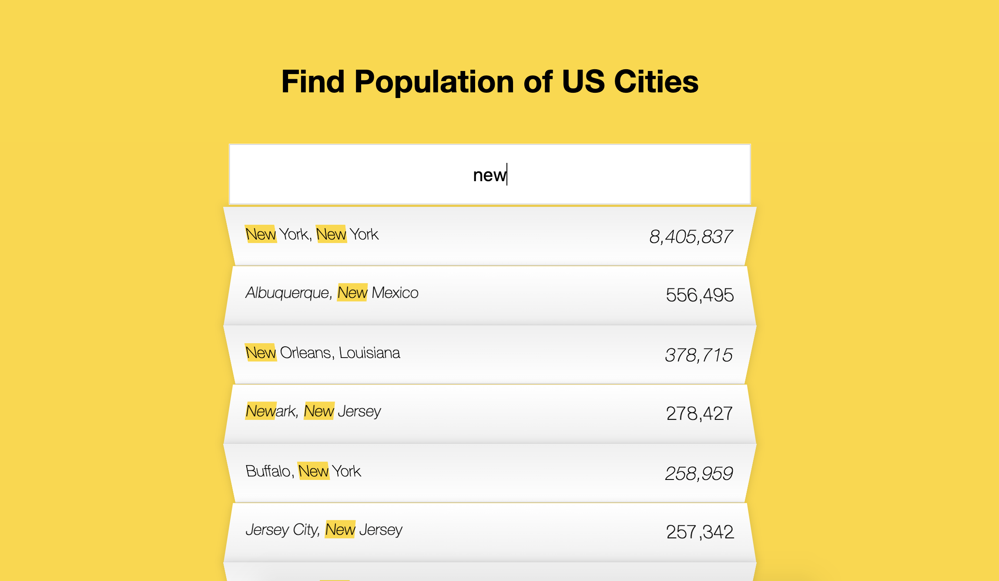

# Population Index of US Cities

This **fully-responsive project** consisted of concepts including: **fetch API, JSON parsing, regex, working with DOM elements** and many more.
The application fetches geographical data from a live json file. When the user inputs a city, the output is filtered to match the corresponding input. The output is the city/state the user inputted alongwith its population.

[Visit Link](https://anantjawanda.github.io/Population-Index/)

### Future Implementations

I plan to add more features to this application, specifically a sorting algoritmn to sort the outputted locations closest to the user's location using a geolocation API.

